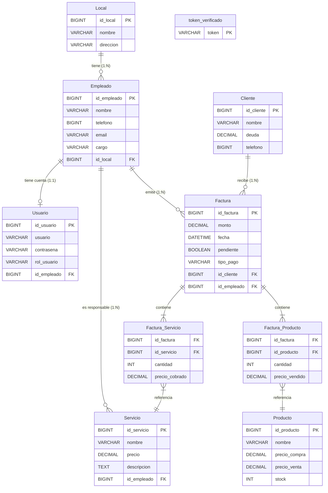

# DOCUMENTACIÓN DEL PROYECTO INTERMODULAR — PeluPOS

**Proyecto:** PeluPOS — Sistema de Gestión para Peluquerías  
**Curso:** 2.º DAM — Proyecto Intermodular  
**Equipo:** Joel Vives · David Rafael Gdaniec · Francisco Javier García  
**Repositorio:** https://github.com/LosDelFondopi2damiesbalmis/proyecto  
**Fecha:** Mayo 2026

---

## Índice

1. [Título](#1-título)
2. [Introducción](#2-introducción)
   - [Objetivo](#21-objetivo)
   - [Justificación](#22-justificación)
   - [Análisis de lo existente](#23-análisis-de-lo-existente)
3. [Requisitos funcionales de la aplicación](#3-requisitos-funcionales-de-la-aplicación)
4. [Análisis y Diseño](#4-análisis-y-diseño)
   - [Diagrama de la arquitectura](#41-diagrama-de-la-arquitectura)
   - [Diagrama de casos de uso](#42-diagrama-de-casos-de-uso)
   - [Diagrama de clases](#43-diagrama-de-clases)
   - [Diseño de datos](#44-diseño-de-datos)
5. [Codificación](#5-codificación)
   - [Entorno de programación](#51-entorno-de-programación)
   - [Lenguajes y herramientas](#52-lenguajes-y-herramientas)
   - [Aspectos relevantes de la implementación](#53-aspectos-relevantes-de-la-implementación)
   - [Documentación de la API REST](#54-documentación-de-la-api-rest)
6. [Manual de usuario](#6-manual-de-usuario)
7. [Requisitos e instalación](#7-requisitos-e-instalación)
8. [Conclusiones](#8-conclusiones)
   - [Conclusiones sobre el trabajo realizado](#81-conclusiones-sobre-el-trabajo-realizado)
   - [Posibles ampliaciones y mejoras](#82-posibles-ampliaciones-y-mejoras)
9. [Bibliografía](#9-bibliografía)
   - [Libros, artículos y apuntes](#91-libros-artículos-y-apuntes)
   - [Direcciones Web](#92-direcciones-web)

---

## 1. Título

**PeluPOS — Sistema de Gestión Integral para Peluquerías y Salones de Belleza**

Sistema multiplataforma compuesto por una aplicación de escritorio Windows (WPF/C#), una aplicación móvil Android (Kotlin/Jetpack Compose) y un backend centralizado (Java/API REST), todos compartiendo la misma base de datos MySQL.

---

## 2. Introducción

### 2.1 Objetivo

El objetivo principal del proyecto PeluPOS es desarrollar un sistema de gestión integral para peluquerías y salones de belleza que permita:

- Gestionar el catálogo de **productos** y **servicios** ofrecidos por el salón.
- Administrar la cartera de **clientes** y el equipo de **empleados**.
- Gestionar los **locales** o sedes de la empresa.
- Operar el **Terminal Punto de Venta (TPV)** para registrar ventas y generar facturas.
- Consultar el historial completo de **ventas y facturas**.
- Administrar los **usuarios** del sistema con control de acceso por roles.
- Visualizar un **dashboard** con métricas del negocio.

El sistema es accesible tanto desde un ordenador Windows (aplicación de escritorio) como desde cualquier dispositivo Android (aplicación móvil), compartiendo el mismo backend.

### 2.2 Justificación

Las peluquerías y salones de belleza son negocios que, en su mayoría, siguen utilizando métodos manuales de gestión: papel, agendas físicas, hojas de cálculo o aplicaciones genéricas no adaptadas a su actividad. Esto genera problemas como:

- **Falta de trazabilidad:** es difícil saber qué vendió quién, cuándo y a qué cliente.
- **Errores en inventario:** el stock de productos se gestiona a mano y es propenso a errores.
- **Ineficiencia en la facturación:** sin un TPV digital, cada venta requiere tiempo extra y no queda registrada de forma estructurada.
- **Sin métricas del negocio:** sin datos digitalizados, no es posible analizar el rendimiento del negocio.

PeluPOS surge para resolver estos problemas con una solución moderna, accesible desde múltiples dispositivos y con una interfaz intuitiva adaptada al perfil del usuario de una peluquería.

### 2.3 Análisis de lo existente

En el mercado existen soluciones de gestión para peluquerías, entre las más conocidas:

| Solución existente | Tipo | Limitaciones |
|---|---|---|
| **Treatwell** | SaaS web | Orientado a reservas online, no a TPV. Requiere suscripción mensual. |
| **Booksy** | SaaS web + móvil | Enfocado en citas, sin gestión completa de TPV/inventario. |
| **Salón Iris** | Escritorio (Windows) | Solo escritorio, sin acceso móvil. Precio elevado. |
| **Square POS** | Web + móvil | Genérico, no adaptado a peluquerías. Comisiones por venta. |
| **Hoja de cálculo (Excel)** | Manual | Sin automatización, sin TPV, sin control de roles. |

**Nivel de innovación de PeluPOS:**

- **Gratuito y de código abierto:** a diferencia de las soluciones SaaS comerciales.
- **Multiplataforma real:** escritorio Windows + móvil Android sobre el mismo backend.
- **Control de roles:** tres niveles (ADMINISTRADOR, MANAGER, EMPLEADO) con permisos diferenciados.
- **Arquitectura moderna:** MVVM en ambos clientes, API REST con JWT, Jetpack Compose, WPF con Material Design.
- **Despliegue propio:** el negocio controla su propio servidor, sin depender de terceros.

---

## 3. Requisitos funcionales de la aplicación

PeluPOS tiene como usuarios principales tres perfiles:

- **Administrador (ADMINISTRADOR):** Propietario o gerente del salón. Acceso total al sistema.
- **Manager (MANAGER):** Encargado de turno o área. Permisos amplios pero sin gestión de configuración.
- **Empleado (EMPLEADO):** Trabajador del salón. Acceso restringido a las tareas operativas del día a día.

### Requisitos funcionales por módulo

| RF | Módulo | Descripción | Roles |
|---|---|---|---|
| RF-01 | Autenticación | El sistema debe permitir el login con usuario y contraseña, devolviendo un JWT | Todos |
| RF-02 | Autenticación | Las sesiones deben poder cerrarse | Todos |
| RF-03 | Dashboard | Mostrar resumen de métricas: ventas, clientes, empleados | Todos |
| RF-04 | Clientes | Listar, crear, editar y eliminar clientes | Todos |
| RF-05 | Empleados | Listar, crear, editar y eliminar empleados | ADMIN |
| RF-06 | Empleados | Asignar empleado a un local | ADMIN |
| RF-07 | Locales | Listar, crear, editar y eliminar sedes | ADMIN |
| RF-08 | Productos | Listar, crear, editar y eliminar productos del catálogo | Todos |
| RF-09 | Productos | Consultar stock de cada producto | Todos |
| RF-10 | Servicios | Listar, crear, editar y eliminar servicios | Todos |
| RF-11 | TPV | Seleccionar cliente y empleado para la venta | Todos |
| RF-12 | TPV | Añadir productos y servicios a una venta | Todos |
| RF-13 | TPV | Calcular el total automáticamente | Todos |
| RF-14 | TPV | Registrar la venta y generar la factura | Todos |
| RF-15 | Ventas | Consultar historial completo de ventas | Todos |
| RF-16 | Ventas | Ver detalle de una venta (líneas, importes) | Todos |
| RF-17 | Ventas | Filtrar ventas por fecha y empleado | Todos |
| RF-18 | Usuarios | Listar, crear, editar y eliminar usuarios del sistema | ADMIN |
| RF-19 | Usuarios | Asignar rol (ADMIN/EMPLEADO) a cada usuario | ADMIN |
| RF-20 | Seguridad | Todos los endpoints de la API deben estar protegidos con JWT | API |

---

## 4. Análisis y Diseño

### 4.1 Diagrama de la arquitectura

PeluPOS es un sistema de tres capas con dos frontends que comparten el mismo backend:

```
┌─────────────────────────┐    ┌──────────────────────────┐
│   APLICACIÓN WPF (C#)   │    │  APLICACIÓN ANDROID (KT) │
│   Windows Desktop       │    │  Android 8.0+            │
│   .NET 8 + XAML         │    │  Jetpack Compose         │
│   MaterialDesignThemes  │    │  Material 3              │
└────────────┬────────────┘    └────────────┬─────────────┘
             │  HTTP + JWT                  │  HTTP + JWT
             │  (HttpClient)                │  (Retrofit + OkHttp)
             └──────────────┬───────────────┘
                            ↓
             ┌──────────────────────────────┐
             │       API REST (Java)        │
             │  Jakarta EE 10 / JAX-RS      │
             │  GlassFish / Payara 7        │
             │  JWT (jjwt)                  │
             └──────────────┬───────────────┘
                            ↓
             ┌──────────────────────────────┐
             │     MySQL 8 (PeluPosBD)      │
             │  Schema: usuarios, clientes, │
             │  empleados, locales,         │
             │  productos, servicios,       │
             │  ventas, lineas_venta        │
             └──────────────────────────────┘
```

Ambas aplicaciones cliente son **frontends equivalentes**: consumen la misma API REST, manejan las mismas entidades de dominio y aplican el mismo modelo de roles. La diferencia es únicamente la plataforma de ejecución y la tecnología de interfaz de usuario.

### 4.2 Diagrama de casos de uso

#### Actor: ADMIN

```
ADMIN ──┬── Iniciar sesión
        ├── Ver Dashboard
        ├── Gestionar Clientes (CRUD)
        ├── Gestionar Empleados (CRUD)
        ├── Gestionar Locales (CRUD)
        ├── Gestionar Productos (CRUD)
        ├── Gestionar Servicios (CRUD)
        ├── Operar TPV
        ├── Consultar Ventas
        ├── Gestionar Usuarios (CRUD)
        └── Cerrar sesión
```

#### Actor: EMPLEADO

```
EMPLEADO ──┬── Iniciar sesión
           ├── Ver Dashboard
           ├── Consultar Clientes
           ├── Gestionar Productos (CRUD)
           ├── Gestionar Servicios (CRUD)
           ├── Operar TPV
           ├── Consultar Ventas
           └── Cerrar sesión
```

> **Nota:** Los actores ADMIN y EMPLEADO acceden al sistema a través de cualquiera de las dos aplicaciones cliente (WPF o Android). La API REST valida el rol en cada petición mediante el JWT.

### 4.3 Diagrama de clases

Las entidades de dominio son las mismas en ambas aplicaciones. A continuación se muestra la estructura principal de clases/modelos:

#### Modelos de dominio (comunes a WPF y Android)

```
┌──────────────────────┐        ┌──────────────────────┐
│       Usuario        │        │       Empleado       │
├──────────────────────┤        ├──────────────────────┤
│ id: Int              │        │ id: Int              │
│ username: String     │        │ nombre: String       │
│ password: String     │        │ apellidos: String    │
│ nombre: String       │        │ telefono: String     │
│ rol: Rol (enum)      │        │ email: String        │
└──────────────────────┘        │ localId: Int         │
                                └──────────┬───────────┘
                                           │ pertenece a
┌──────────────────────┐        ┌──────────┴───────────┐
│       Cliente        │        │        Local         │
├──────────────────────┤        ├──────────────────────┤
│ id: Int              │        │ id: Int              │
│ nombre: String       │        │ nombre: String       │
│ apellidos: String    │        │ direccion: String    │
│ telefono: String     │        │ telefono: String     │
│ email: String        │        └──────────────────────┘
└──────────────────────┘

┌──────────────────────┐        ┌──────────────────────┐
│       Producto       │        │       Servicio       │
├──────────────────────┤        ├──────────────────────┤
│ id: Int              │        │ id: Int              │
│ nombre: String       │        │ nombre: String       │
│ descripcion: String  │        │ descripcion: String  │
│ precio: Double       │        │ precio: Double       │
│ stock: Int           │        │ duracion: Int        │
└──────────────────────┘        └──────────────────────┘

┌─────────────────────────────────────────────────────┐
│                      Venta                          │
├─────────────────────────────────────────────────────┤
│ id: Int                                             │
│ fecha: Date                                         │
│ clienteId: Int  →  Cliente                          │
│ empleadoId: Int →  Empleado                         │
│ total: Double                                       │
│ lineas: List<LineaVenta>                            │
└─────────────────────────────────────────────────────┘
                    │ contiene 1..*
┌─────────────────────────────────────────────────────┐
│                   LineaVenta                        │
├─────────────────────────────────────────────────────┤
│ id: Int                                             │
│ ventaId: Int                                        │
│ productoId: Int? → Producto (opcional)              │
│ servicioId: Int? → Servicio (opcional)              │
│ cantidad: Int                                       │
│ precioUnitario: Double                              │
└─────────────────────────────────────────────────────┘
```

#### ViewModels — Patrón MVVM (WPF y Android)

```
┌──────────────────────────┐    ┌─────────────────────────────┐
│  LoginViewModel (WPF)    │    │  LoginViewModel (Android)   │
├──────────────────────────┤    ├─────────────────────────────┤
│ username: String         │    │ username: StateFlow<String> │
│ password: String         │    │ password: StateFlow<String> │
│ + LoginCommand()         │    │ + login()                   │
└──────────────────────────┘    └─────────────────────────────┘

┌──────────────────────────┐    ┌─────────────────────────────┐
│  ClienteViewModel (WPF)  │    │ ClienteViewModel (Android)  │
├──────────────────────────┤    ├─────────────────────────────┤
│ Clientes: List           │    │ uiState: StateFlow<UiState> │
│ SelectedCliente          │    │ + loadClientes()            │
│ + LoadCommand()          │    │ + addCliente()              │
│ + AddCommand()           │    │ + editCliente()             │
│ + EditCommand()          │    │ + deleteCliente()           │
│ + DeleteCommand()        │    └─────────────────────────────┘
└──────────────────────────┘
```

> El mismo patrón se repite para EmpleadoViewModel, LocalViewModel, ProductoViewModel, ServicioViewModel, TPVViewModel y VentaViewModel.

### 4.4 Diseño de datos

La base de datos es **relacional** (MySQL 8), con el esquema `peluposbd`. Las tablas reales y sus columnas son:

| Tabla | Columnas principales | Relaciones |
|---|---|---|
| `Local` | `id_local` (PK), `nombre`, `direccion` | — |
| `Cliente` | `id_cliente` (PK), `nombre`, `deuda`, `telefono` | — |
| `Producto` | `id_producto` (PK), `nombre`, `precio_compra`, `precio_venta`, `stock` | — |
| `Empleado` | `id_empleado` (PK), `nombre`, `telefono`, `email`, `cargo`, `id_local` | FK → `Local.id_local` (SET NULL) |
| `Usuario` | `id_usuario` (PK), `usuario` (UNIQUE), `contrasena`, `rol_usuario`, `id_empleado` (UNIQUE) | FK → `Empleado.id_empleado` (CASCADE, 1:1) |
| `Servicio` | `id_servicio` (PK), `nombre`, `precio`, `descripcion`, `id_empleado` | FK → `Empleado.id_empleado` (SET NULL) |
| `Factura` | `id_factura` (PK), `monto`, `fecha`, `pendiente`, `tipo_pago`, `id_cliente`, `id_empleado` | FK → `Cliente.id_cliente`, `Empleado.id_empleado` (SET NULL) |
| `Factura_Producto` | `id_factura` (PK, FK), `id_producto` (PK, FK), `cantidad`, `precio_vendido` | FK → `Factura`, `Producto` (CASCADE) |
| `Factura_Servicio` | `id_factura` (PK, FK), `id_servicio` (PK, FK), `cantidad`, `precio_cobrado` | FK → `Factura`, `Servicio` (CASCADE) |
| `token_verificado` | `token` (PK) | Tokens JWT revocados/verificados |

> **Roles de usuario:** `ADMINISTRADOR`, `MANAGER`, `EMPLEADO` (CHECK constraint en `rol_usuario`).  
> `Factura.pendiente` (BOOLEAN) indica si la factura tiene deuda pendiente de cobro.  
> `Producto` almacena tanto `precio_compra` como `precio_venta` para control de márgenes.

**Diagrama Entidad-Relación (Mermaid):**

> El diagrama se renderiza automáticamente en GitHub, GitLab, VS Code (extensión Markdown Preview Mermaid) y Obsidian.



**Cardinalidades resumidas:**

| Relación | Cardinalidad | Descripción |
|---|---|---|
| `Local` → `Empleado` | 1 : N | Un local tiene muchos empleados |
| `Empleado` → `Usuario` | 1 : 1 | Cada empleado tiene un único usuario (UNIQUE FK) |
| `Empleado` → `Servicio` | 1 : N | Un empleado puede ser responsable de varios servicios por defecto |
| `Cliente` → `Factura` | 1 : N | Un cliente puede tener varias facturas |
| `Empleado` → `Factura` | 1 : N | Un empleado puede emitir varias facturas |
| `Factura` ↔ `Producto` | N : M | A través de `Factura_Producto` (con `cantidad` y `precio_vendido`) |
| `Factura` ↔ `Servicio` | N : M | A través de `Factura_Servicio` (con `cantidad` y `precio_cobrado`) |

Los scripts de base de datos se encuentran en:
- `API Rest PeluPosBD/peluposbd.sql` — Creación del esquema y tablas
- `API Rest PeluPosBD/DatosPruebaPeluPosBD.sql` — Datos de prueba
- `API Rest PeluPosBD/BorrarBD.sql` — Limpieza del esquema
- `API Rest PeluPosBD/diagrama base de datos PeluPosBD.jpg` — Diagrama visual

---

## 5. Codificación

### 5.1 Entorno de programación

| Componente | IDE / Entorno | Sistema operativo |
|---|---|---|
| Aplicación WPF (C#) | Visual Studio 2022 | Windows 10/11 |
| Aplicación Android (Kotlin) | Android Studio Giraffe+ | Windows 10/11 |
| API REST (Java) | NetBeans 19+ | Windows 10/11 |
| Base de datos MySQL | MySQL Workbench 8 | Windows 10/11 |
| Control de versiones | Git + GitHub | Multiplataforma |
| Pruebas API | Postman | Multiplataforma |

### 5.2 Lenguajes y herramientas

#### Aplicación de Escritorio (WPF)

| Categoría | Tecnología | Versión / Detalle |
|---|---|---|
| Lenguaje | C# | .NET 8+ |
| Framework UI | WPF (Windows Presentation Foundation) | .NET 8 |
| Patrón arquitectónico | MVVM | Model-View-ViewModel |
| Librería MVVM | CommunityToolkit.Mvvm | `ObservableObject`, `[ObservableProperty]`, `[RelayCommand]` |
| Librería UI | MaterialDesignThemes | Controles WPF con estilo Material Design |
| HTTP Client | `System.Net.Http.HttpClient` | Comunicación con la API REST |
| Serialización JSON | `System.Text.Json` | Deserialización de respuestas |
| Autenticación | JWT | Token gestionado en `SessionService` |

#### Aplicación Móvil (Android / Kotlin)

| Categoría | Tecnología | Versión / Detalle |
|---|---|---|
| Lenguaje | Kotlin | JVM Target 17 |
| Framework UI | Jetpack Compose + Material 3 | `compileSdk 34` |
| Patrón arquitectónico | MVVM | Model-View-ViewModel |
| Inyección de dependencias | Dagger Hilt | `@HiltAndroidApp`, `@HiltViewModel`, `@Inject` |
| Navegación | Navigation Compose | Rutas tipadas con `@Serializable` |
| HTTP Client | Retrofit 2 + OkHttp 4 | Comunicación con la API REST |
| Serialización JSON | Gson (Retrofit converter) | JSON ↔ Kotlin |
| Autenticación | JWT via `AuthInterceptor` | Token adjuntado automáticamente |
| Persistencia local | Room (AndroidX) | Integración en curso |
| Build system | Gradle KTS | `build.gradle.kts` |

#### Backend (API REST)

| Categoría | Tecnología | Versión / Detalle |
|---|---|---|
| Lenguaje | Java | Jakarta EE 10 |
| API | JAX-RS (Jakarta REST) | Endpoints REST |
| Servidor | GlassFish / Payara 7 | Servidor de aplicaciones Jakarta EE |
| Base de datos | MySQL 8 | Esquema `PeluPosBD` |
| Conector BD | MySQL Connector/J 8.0.33 | JDBC |
| Autenticación | JWT (jjwt) | Emisión y validación de tokens |
| Colección pruebas | Postman | `PeluPos.postman_collection.json` |

### 5.3 Aspectos relevantes de la implementación

#### Patrón MVVM — Comparativa WPF vs Android

| Aspecto | WPF (C#) | Android (Kotlin) |
|---|---|---|
| UI | XAML declarativo | Jetpack Compose (Kotlin puro) |
| Data Binding | `{Binding}` en XAML | `collectAsState()` de `StateFlow` |
| Inyección de dependencias | Contenedor estático (`AppServices`) | Dagger Hilt (`@HiltViewModel`) |
| Navegación | `Frame` + `Page` en `MainWindow` | `NavHost` + rutas tipadas `@Serializable` |
| Estado de UI | `[ObservableProperty]` + `INotifyPropertyChanged` | `StateFlow<UiState>` + `sealed class` |
| Ciclo de vida | Sin gestión especial (desktop) | `LaunchedEffect`, `ViewModel` scoped a `NavBackStackEntry` |

#### Gestión de sesión y roles

El sistema define dos roles:

| Rol | Permisos |
|---|---|
| **ADMIN** | Acceso total: gestión de usuarios, locales, empleados, clientes, productos, servicios, TPV y ventas |
| **EMPLEADO** | Acceso restringido: TPV, consulta de clientes, productos y servicios. Sin acceso a usuarios ni locales |

**Flujo de autenticación:**

```
Usuario introduce credenciales
        ↓
POST /auth/login  →  API valida y devuelve JWT
        ↓
Token almacenado en SessionService (WPF) / DataStore (Android)
        ↓
Todas las peticiones incluyen: Authorization: Bearer <token>
        ↓
La API valida el token y el rol en cada request
        ↓
Views/Menús se adaptan al rol del usuario logueado
```

**WPF:** El token y los datos de usuario se almacenan en `SessionService` (singleton inyectado). Las vistas comprueban `SessionService.Rol` para mostrar u ocultar opciones de menú.

**Android:** El token se almacena en `DataStore` (persistencia local) y se inyecta en cada llamada HTTP mediante el `AuthInterceptor` de OkHttp. La navegación está condicionada al rol recibido tras el login.

#### Inyección de dependencias en WPF

```csharp
// AppServices.cs — contenedor estático de servicios
public static class AppServices
{
    public static IClienteService ClienteService { get; }
    public static IEmpleadoService EmpleadoService { get; }
    public static IProductoService ProductoService { get; }
    // ...
    static AppServices()
    {
        var httpClient = new HttpClient { BaseAddress = new Uri("http://localhost:8080/ApiRestPeluPos/api/") };
        ClienteService = new ClienteApiService(httpClient);
        // ...
    }
}
```

#### Inyección de dependencias en Android (Dagger Hilt)

```kotlin
// AppModule.kt
@Module
@InstallIn(SingletonComponent::class)
object AppModule {
    @Provides @Singleton
    fun provideRetrofit(): Retrofit = Retrofit.Builder()
        .baseUrl("http://<servidor>:8080/ApiRestPeluPos/api/")
        .addConverterFactory(GsonConverterFactory.create())
        .client(OkHttpClient.Builder().addInterceptor(AuthInterceptor()).build())
        .build()
}
```

#### Estado de UI en Android con sealed class

```kotlin
sealed class ClienteUiState {
    object Loading : ClienteUiState()
    data class Success(val clientes: List<Cliente>) : ClienteUiState()
    data class Error(val message: String) : ClienteUiState()
}

@HiltViewModel
class ClienteViewModel @Inject constructor(
    private val clienteRepo: ClienteRepository
) : ViewModel() {
    private val _uiState = MutableStateFlow<ClienteUiState>(ClienteUiState.Loading)
    val uiState: StateFlow<ClienteUiState> = _uiState.asStateFlow()

    fun loadClientes() {
        viewModelScope.launch {
            _uiState.value = ClienteUiState.Loading
            try {
                _uiState.value = ClienteUiState.Success(clienteRepo.getAll())
            } catch (e: Exception) {
                _uiState.value = ClienteUiState.Error(e.message ?: "Error desconocido")
            }
        }
    }
}
```

### 5.4 Documentación de la API REST

#### Base URL

```
http://<servidor>:8080/ApiRestPeluPos/api/
```

#### Autenticación

Todos los endpoints (salvo `/auth/login`) requieren el header:
```
Authorization: Bearer <JWT_TOKEN>
```

El token se obtiene tras un login exitoso y tiene una validez configurable en el servidor. Si el token es inválido o ha expirado, la API devuelve `401 Unauthorized`.

---

#### Endpoint: Autenticación

**`POST /auth/login`**

Autentica un usuario y devuelve un JWT.

| Campo | Tipo | Descripción |
|---|---|---|
| `username` | String | Nombre de usuario |
| `password` | String | Contraseña |

**Request:**
```http
POST /ApiRestPeluPos/api/auth/login
Content-Type: application/json

{
  "username": "admin",
  "password": "1234"
}
```

**Response `200 OK`:**
```json
{
  "token": "eyJhbGciOiJIUzI1NiIsInR5cCI6IkpXVCJ9...",
  "rol": "ADMIN",
  "nombre": "Administrador"
}
```

---

#### Endpoints: Usuarios

| Método | Endpoint | Descripción | Auth requerida |
|---|---|---|---|
| `GET` | `/usuarios` | Lista todos los usuarios | ADMIN |
| `GET` | `/usuarios/{id}` | Obtiene usuario por ID | ADMIN |
| `POST` | `/usuarios` | Crea un nuevo usuario | ADMIN |
| `PUT` | `/usuarios/{id}` | Actualiza un usuario | ADMIN |
| `DELETE` | `/usuarios/{id}` | Elimina un usuario | ADMIN |

**Modelo Usuario (JSON):**
```json
{
  "id": 1,
  "username": "admin",
  "nombre": "Administrador",
  "rol": "ADMIN"
}
```

---

#### Endpoints: Empleados

| Método | Endpoint | Descripción |
|---|---|---|
| `GET` | `/empleados` | Lista todos los empleados |
| `GET` | `/empleados/{id}` | Obtiene empleado por ID |
| `POST` | `/empleados` | Crea un nuevo empleado |
| `PUT` | `/empleados/{id}` | Actualiza un empleado |
| `DELETE` | `/empleados/{id}` | Elimina un empleado |

---

#### Endpoints: Clientes

| Método | Endpoint | Descripción |
|---|---|---|
| `GET` | `/clientes` | Lista todos los clientes |
| `GET` | `/clientes/{id}` | Obtiene cliente por ID |
| `POST` | `/clientes` | Crea un nuevo cliente |
| `PUT` | `/clientes/{id}` | Actualiza un cliente |
| `DELETE` | `/clientes/{id}` | Elimina un cliente |

**Ejemplo — Crear cliente:**
```http
POST /ApiRestPeluPos/api/clientes
Authorization: Bearer <token>
Content-Type: application/json

{
  "nombre": "María",
  "apellidos": "García López",
  "telefono": "612345678",
  "email": "maria@ejemplo.com"
}
```
**Response `201 Created`:**
```json
{ "id": 42, "nombre": "María", "apellidos": "García López", "telefono": "612345678", "email": "maria@ejemplo.com" }
```

---

#### Endpoints: Locales

| Método | Endpoint | Descripción |
|---|---|---|
| `GET` | `/locales` | Lista todos los locales |
| `GET` | `/locales/{id}` | Obtiene local por ID |
| `POST` | `/locales` | Crea un nuevo local |
| `PUT` | `/locales/{id}` | Actualiza un local |
| `DELETE` | `/locales/{id}` | Elimina un local |

---

#### Endpoints: Productos

| Método | Endpoint | Descripción |
|---|---|---|
| `GET` | `/productos` | Lista todos los productos |
| `GET` | `/productos/{id}` | Obtiene producto por ID |
| `POST` | `/productos` | Crea un nuevo producto |
| `PUT` | `/productos/{id}` | Actualiza un producto |
| `DELETE` | `/productos/{id}` | Elimina un producto |

---

#### Endpoints: Servicios

| Método | Endpoint | Descripción |
|---|---|---|
| `GET` | `/servicios` | Lista todos los servicios |
| `GET` | `/servicios/{id}` | Obtiene servicio por ID |
| `POST` | `/servicios` | Crea un nuevo servicio |
| `PUT` | `/servicios/{id}` | Actualiza un servicio |
| `DELETE` | `/servicios/{id}` | Elimina un servicio |

---

#### Endpoints: Ventas

| Método | Endpoint | Descripción |
|---|---|---|
| `GET` | `/ventas` | Lista todas las ventas |
| `GET` | `/ventas/{id}` | Obtiene venta por ID |
| `POST` | `/ventas` | Registra una nueva venta |
| `PUT` | `/ventas/{id}` | Actualiza una venta |
| `DELETE` | `/ventas/{id}` | Elimina una venta |

**Ejemplo — Registrar venta:**
```http
POST /ApiRestPeluPos/api/ventas
Authorization: Bearer <token>
Content-Type: application/json

{
  "clienteId": 5,
  "empleadoId": 2,
  "lineas": [
    { "productoId": 10, "cantidad": 2, "precioUnitario": 12.50 },
    { "servicioId": 3,  "cantidad": 1, "precioUnitario": 25.00 }
  ]
}
```
**Response `201 Created`:**
```json
{ "id": 101, "fecha": "2026-05-25", "clienteId": 5, "empleadoId": 2, "total": 50.00 }
```

---

#### Códigos de respuesta HTTP

| Código | Significado |
|---|---|
| `200 OK` | Operación correcta (GET, PUT) |
| `201 Created` | Recurso creado (POST) |
| `204 No Content` | Eliminación correcta (DELETE) |
| `400 Bad Request` | Datos de entrada incorrectos |
| `401 Unauthorized` | Token ausente o inválido |
| `403 Forbidden` | Rol insuficiente |
| `404 Not Found` | Recurso no encontrado |
| `500 Internal Server Error` | Error inesperado del servidor |

---

## 6. Manual de usuario

El manual de usuario completo (con capturas de pantalla y guías paso a paso) se encuentra en el fichero:

📄 **[MANUAL_USUARIO_PELUPOS.md](./MANUAL_USUARIO_PELUPOS.md)**

### Resumen de secciones del manual

| Sección | Contenido |
|---|---|
| Login | Acceso con usuario y contraseña; credenciales por defecto |
| Dashboard | Pantalla principal y navegación |
| Clientes | Listado, alta, edición y eliminación de clientes |
| Empleados | Listado, alta, edición y eliminación de empleados |
| Locales | Gestión de sedes (solo ADMIN) |
| Productos | Catálogo con precios y stock |
| Servicios | Catálogo de servicios con duración |
| TPV | Flujo completo de venta: selección → líneas → cobro |
| Ventas | Historial y detalle de facturas |
| Usuarios | Gestión de cuentas y roles (solo ADMIN) |
| Cerrar sesión | Cierre de sesión en WPF y Android |

---

## 7. Requisitos e instalación

### Requisitos previos

| Componente | Requisito mínimo |
|---|---|
| **API REST** | JDK 17+, GlassFish/Payara 7, MySQL 8 |
| **App WPF** | Windows 10/11, .NET 8 Runtime |
| **App Android** | Android 8.0+ (API 26) |
| **Compilación WPF** | Visual Studio 2022 |
| **Compilación Android** | Android Studio Giraffe+ |
| **Compilación API** | NetBeans 19+ |

### 7.1 Instalación del Backend (API REST)

1. **Crear la base de datos** en MySQL:
   ```sql
   SOURCE "API Rest PeluPosBD/peluposbd.sql";
   -- Opcional: cargar datos de prueba
   SOURCE "API Rest PeluPosBD/DatosPruebaPeluPosBD.sql";
   ```

2. **Configurar la conexión JDBC** en `ApiRestPeluPos/src/conf/` con el host, puerto, usuario y contraseña de MySQL.

3. **Desplegar en GlassFish/Payara** desde NetBeans: abrir el proyecto `ApiRestPeluPos` y ejecutar *Run* / *Deploy*.

4. **Verificar** en: `http://localhost:8080/ApiRestPeluPos/api/`

5. **Probar con Postman:** importar `API Rest PeluPosBD/pruebas Postman/PeluPos.postman_collection.json`.

### 7.2 Instalación de la Aplicación WPF

**Opción A — Ejecutable compilado:**
1. Navegar a `Proyecto WPF PelusPos/PeluPOS/bin/Release/`.
2. Ejecutar `PeluPOS.exe`.

**Opción B — Compilar desde código fuente:**
1. Abrir `Proyecto WPF PelusPos/PeluPOS.sln` con Visual Studio 2022.
2. Restaurar paquetes NuGet (automático).
3. Configurar la URL base de la API en `Services/Api/` si es distinta a `localhost:8080`.
4. Compilar (`Ctrl+Shift+B`) y ejecutar (`F5`).

### 7.3 Instalación de la Aplicación Android

**Opción A — Android Studio:**
1. Abrir `Proyecto kotlin PeluPos/PeluPos/` en Android Studio.
2. Sincronizar Gradle (`File > Sync Project with Gradle Files`).
3. Ajustar la IP del servidor en el módulo Retrofit.
4. Conectar dispositivo Android (API 26+) o iniciar emulador.
5. Ejecutar con `Run > Run 'app'`.

**Opción B — APK precompilado:**
1. Transferir el APK de `app/build/outputs/apk/` al dispositivo.
2. Habilitar *Instalación de fuentes desconocidas* en el dispositivo.
3. Instalar el APK.

---

## 8. Conclusiones

### 8.1 Conclusiones sobre el trabajo realizado

PeluPOS es el resultado del trabajo conjunto de tres desarrolladores a lo largo de seis sprints de desarrollo iterativo (noviembre 2025 – mayo 2026).

**Logros principales:**

- **Sistema completo y funcional:** los tres componentes (WPF, Android, API REST) están implementados e integrados como sistema cohesionado.
- **Arquitectura limpia y escalable:** separación clara entre presentación, lógica de negocio y datos en los tres componentes.
- **Patrón MVVM consistente:** ambas aplicaciones cliente siguen el mismo patrón arquitectónico, facilitando el mantenimiento y la extensión del sistema.
- **Seguridad real:** la API REST implementa autenticación JWT y control de acceso por roles en todos los endpoints.
- **Cobertura funcional completa:** el sistema cubre todo el ciclo de negocio de una peluquería, desde la gestión del catálogo hasta la facturación.
- **Metodología ágil:** el equipo trabajó con sprints iterativos, entregando valor incremental en cada iteración.

**Contribución por miembro:**

| Miembro | Contribución principal |
|---|---|
| **Joel Vives** | Aplicación WPF completa: arquitectura MVVM, todas las vistas, TPV, login, integración API REST |
| **David Rafael Gdaniec** | Aplicación Android completa (Jetpack Compose, todos los módulos) + API REST completa (BD, endpoints CRUD, JWT, Postman) |
| **Francisco Javier García** | Soporte en ambos proyectos, corrección de errores, pantallas adicionales Android |

### 8.2 Posibles ampliaciones y mejoras

- **Integración Android con API REST:** completar la migración de datos mock a llamadas Retrofit en todos los módulos de la app Android.
- **Persistencia offline (Android):** implementar Room para caché local y funcionamiento sin conexión.
- **Módulo de citas y agenda:** añadir gestión de citas y recordatorios para clientes.
- **Generación de PDFs:** exportar facturas en formato PDF desde ambas aplicaciones.
- **Notificaciones push:** alertas de citas próximas y recordatorios a clientes.
- **Despliegue en la nube:** desplegar el backend en servidor remoto (infraestructura disponible en `APINube/`).
- **Estadísticas avanzadas:** dashboard con gráficos de ventas por periodo, empleado y servicio.
- **Aplicación web:** tercer frontend web (React/Angular) consumiendo la misma API REST.

---

## 9. Bibliografía

### 9.1 Libros, artículos y apuntes

- **Apuntes del módulo de Programación Multimedia y Dispositivos Móviles (PMDM)** — 2.º DAM, curso 2025-2026.
- **Apuntes del módulo de Acceso a Datos (AD)** — 2.º DAM, curso 2025-2026.
- **Apuntes del módulo de Programación de Servicios y Procesos (PSP)** — 2.º DAM, curso 2025-2026.
- Gamma, E. et al. *Design Patterns: Elements of Reusable Object-Oriented Software*. Addison-Wesley, 1994.
- Richardson, L.; Ruby, S. *RESTful Web Services*. O'Reilly Media, 2007.

### 9.2 Direcciones Web

| Recurso | URL |
|---|---|
| Documentación oficial .NET / WPF | https://learn.microsoft.com/es-es/dotnet/desktop/wpf/ |
| CommunityToolkit.Mvvm | https://learn.microsoft.com/es-es/dotnet/communitytoolkit/mvvm/ |
| Material Design in XAML | https://github.com/MaterialDesignInXAML/MaterialDesignInXamlToolkit |
| Jetpack Compose | https://developer.android.com/develop/ui/compose |
| Navigation Compose | https://developer.android.com/guide/navigation/navigation-compose |
| Dagger Hilt | https://developer.android.com/training/dependency-injection/hilt-android |
| Retrofit 2 | https://square.github.io/retrofit/ |
| Jakarta EE 10 / JAX-RS | https://jakarta.ee/specifications/restful-ws/ |
| GlassFish / Eclipse | https://glassfish.org/ |
| MySQL 8 | https://dev.mysql.com/doc/refman/8.0/en/ |
| jjwt (JWT Java) | https://github.com/jwtk/jjwt |
| Postman | https://www.postman.com/ |
| Repositorio del proyecto | https://github.com/LosDelFondopi2damiesbalmis/proyecto |

---

*Documento elaborado por el equipo de desarrollo de PeluPOS.*  
*Fecha de última actualización: 25 de mayo de 2026.*
