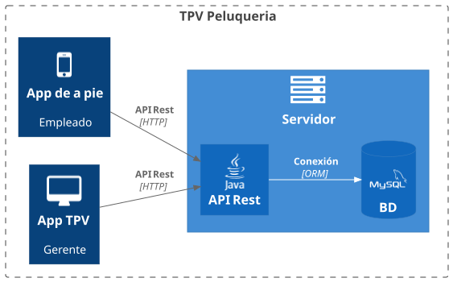

# PeluPOS

**PeluPOS:**  Sistema de gestión integral que permite administrar citas, ventas, stock de productos y control de clientes en peluquerías, optimizando la eficiencia del negocio y la atención al cliente.

## Datos de equipo

| Nombre | Rol | GitHub |
|--------|------|--------|
| Francisco Javier García Gómez | Analista | [@kennzzaki](https://github.com/kennzzaki) |
| David Rafael Gdaniec | Desarrollador | [@DavidRafaelGdaniec](https://github.com/DavidRafaelGdaniec) |
| Joel Vives Vidal| Gestor | [@SkYGi560](https://github.com/SkYGi560) |

## Alineacion con los ODS

### 🎯 ODS 8: Trabajo decente y crecimiento económico

> *Promover el crecimiento económico sostenido, inclusivo y sostenible, el empleo pleno y productivo y el trabajo decente para todos.*

- Fomenta la digitalización de pequeñas empresas del sector belleza.  
- Mejora la productividad y la gestión de ingresos, apoyando la formalización laboral.

### 💡 ODS 9: Industria, innovación e infraestructura

> *Construir infraestructuras resilientes, promover la industrialización inclusiva y sostenible y fomentar la innovación.*

- Introduce tecnología accesible e innovadora en negocios tradicionales.  
- Contribuye al desarrollo de infraestructuras digitales locales.

### 🌱 ODS 12: Producción y consumo responsables

> *Garantizar modalidades de consumo y producción sostenibles.*

- Permite controlar el uso de productos (tintes, champús, cosméticos), reduciendo desperdicio y sobreconsumo.  
- Optimiza el inventario para un uso más eficiente de recursos.

### ⚖️ ODS 5: Igualdad de género

> *Lograr la igualdad entre los géneros y empoderar a todas las mujeres y las niñas.*

- El sector de peluquería está altamente representado por mujeres emprendedoras.  
- El TPV impulsa su autonomía económica mediante el uso de herramientas tecnológicas.

## Descripcion del problema

En el sector de la peluquería suele haber mucho descontrol sobre la gestion de los clientes y del stock de la tienda. Ademas muchas veces la gente que trabaja en estos sitios no estan muy familiarizados con las tecnologías y suelen tomar caminos mas tradicionales para la gestión lo cual limita mucho la producción y el uso de los productos entre otros problemas.

## Descripción de la solución propuesta

**Nombre de la aplicacion** es una solución software multiplataforma que esta diseñada para ayudar a la gestión de empleados, de clientes y de stock. El sistema tendra tres componentes principales:

1. **Aplicacion Movil para los empleados de a pie (Android Kotlin y Jetpack Compose):** Será algo opcional que podrán tener las peluquerías con mas empleados pero que no será obligatorio para las peluqerías mas pequeñas. Aquí se tendra acceso a las herramientas mas sencillas de la aplicación y no habra acceso a nada de administración
2. **Aplicación escritorio para el Gerente(WPF con C# y MVVM):** Una herramienta con acceso total a todas las herramientas de la aplicación como crear clientes, crear proveedores, formas de pago, productos y los servicios de la tienda. Además de tener acceso a todos los datos y el rendimiento general de la empresa.
3. **Servicio Backend (API Rest con Java):** Gestionara la lógica de la aplicación y la autenticación del usuario mediante JWT y asegurará una comunicación segura con la base de datos.

## Actores y roles

| Actor | Descripción | Permisos / Funcionalidades |
|-------|--------------|-----------------------------|
| **Administrador** | Propietario o encargado del negocio. | Gestionar usuarios, citas, productos, ventas, informes y configuración general. |
| **Empleado** | Personal de peluquería. | Registrar ventas, consultar citas, actualizar inventario y clientes. |

## Arquitectura general



## Casos de uso

### Para Trabajadores (App Móvil)

| Casos de uso | Descripción | Prioridad |
|-------|--------|-------------------|
|**Registro de usuario**|Tanto los clientes como los trabajadores podrán registrarse en nuestra app cada uno con sus respectivos permisos|Alta|
|**Publicar productos para su venta**| los trabajadores podrán publicar diferentes productos relacionados con la peluquería así como los servicios de la propia peluquería (cuando el peluquero esté disponible para la reserva de su servicio) | Alta|
|**Comprobar el estado del producto**|Comprobar si el producto/servicio esté disponible o alguien lo ha reservado (y en caso de los productos comprobar si se ha vendido)|Alta|
|**Consultar agenda**| Podrán comprobar todas las citas y reservas que tengan a lo largo de la semana | Media |
|**Gestión de clientes**|Los trabajadores pueden gestionar los clientes registrándolos con su nombre, teléfono, etc... y organizarlos dependiendo de si son casuales o son recurrentes|Alta|
|**Registros de ventas**|Los trabajadores podrán mantener y comprobar un registro de todos los servicios y productos disponibles para la venta|Alta|

### Para Administradores (App Escritorio)

| Casos de uso | Descripción | Prioridad |
|-------|--------|-------------------|
|**Registro de usuario**|Tanto los clientes como los trabajadores/administradores podrán registrarse en nuestra app cada uno con sus respectivos permisos|Alta|
|**Gestion de usuarios**| Podrán gestionar tanto trabajadores como clientes, asignándoles sus permisos | Alta|
|**Validar productos**|Comprobar los productos que se están vendiendo|Media|
|**Gestionar Ventas**| Pueden gestionar la ventas que se hacen | Alta |
|**T.P.V**| Actua como TPV para gestionar todo lo que se vende | Alta |
|**Gestionar Clientes**| Creacion y modificacion de clientes | Baja |
|**Gestionar Servicios**| Todo lo que conlleva la creacion y modificacion de servicios a la venta | Baja |

## Riesgos y mitigación

| Riesgo | Mitigación |
|--------|-------------|
| Integración entre backend y apps (Android/WPF) | Uso de Swagger para documentar la API y realizar pruebas con datos mock antes de la integración. |
| Complejidad del sistema de autenticación JWT | Taller interno de seguridad + uso de plantilla base o sesiones temporales durante el desarrollo inicial. |
| Retraso en la integración entre módulos | Aplicación de *feature flags* para desactivar funcionalidades no críticas sin afectar la estabilidad general. |
| *Scope creep* (ampliación del alcance del proyecto) | Definición clara del MVP y priorización estricta del backlog por sprint. |
| Falta de experiencia técnica en parte del equipo | Uso de IA para generación de código, resolución de dudas y revisión de buenas prácticas. |

## Planificación aproximada Sprints

| Sprint | Semanas | Fecha fin | Entregable clave |
|--------|---------|-----------|-----------------------------------------------------------------------|
| 1      | 7-8     | 31 oct    | Modelo de dominio Java + diagramas |
| 2      | 9-10    | 14 nov    | Clases transpiladas a C#/Kotlin + mocks con IA |
| 3      | 11-12   | 28 nov    | Prototipos UI/UX Stitch/Figma (Material 3 & XAML) |
| 4      | 13-14   | 12 dic    | App WPF navegable con datos mock **(1ª evaluación)**|
| 5      | 15-16   | 16 ene    | App Android navegable con estados mock |
| 6      | 17-18   | 30 ene    | Lógica de negocio en WPF (MVVM) |
| 7      | 19-20   | 13 feb    | Lógica de negocio en Android (MVI) |
| 8      | 21-22   | 27 feb    | API REST CRUD + BBDD MySQL **(2ª evaluación)** |
| 9      | 23-24   | 13 mar    | Servicios de negocio + DTOs + excepciones |
| 10     | 25-26   | 27 mar    | Seguridad: registro/login JWT + Autorización por roles |
| 11     | 27-28   | 08 may    | Documentación API con Swagger e Integración full-stack escritorio |
| 12     | 29-30   | 22 may    | Integración full-stack Android |
| 13     | 31-32   | 05 jun    | Memoria final, vídeo 2 min, presentación oral |

## Organización Repositorio

```text
https://github.com/LosDelFondopi2damiesbalmis/proyecto.git
├─ docs/
│ ├─ PROYECTO.md ← visión, ODS, casos de uso
│ ├─ DISENO.md ← modelo, decisiones arquitectónicas
│ └─ DIARIO.md ← seguimiento semanal individual
├─ backend/
├─ frontend-wpf/
└─ frontend-android/
```
